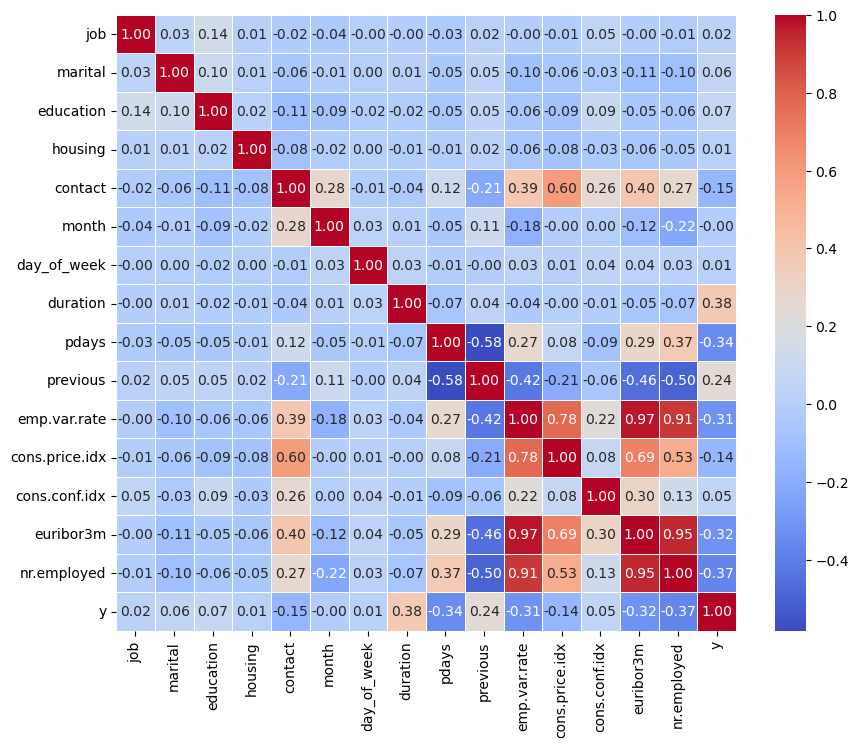

# Practical Application III: Comparing Classifiers

**Overview**: In this practical application, your goal is to compare the performance of the classifiers we encountered in this section, namely K Nearest Neighbor, Logistic Regression, Decision Trees, and Support Vector Machines.  We will utilize a dataset related to marketing bank products over the telephone.  


### Getting Started

Our dataset comes from the UCI Machine Learning repository [link](https://archive.ics.uci.edu/ml/datasets/bank+marketing).  The data is from a Portugese banking institution and is a collection of the results of multiple marketing campaigns.  We will make use of the article accompanying the dataset [here](CRISP-DM-BANK.pdf) for more information on the data and features.


### Problem 1: Understanding the Data

To gain a better understanding of the data, please read the information provided in the UCI link above, and examine the **Materials and Methods** section of the paper.  How many marketing campaigns does this data represent?

The data collected is related to 17 campaigns that occurred between May 2008 and November 2010, corresponding to a total of 79,354 contacts.

### Problem 2: Read in the Data

Use pandas to read in the dataset `bank-additional-full.csv` and assign to a meaningful variable name.


```python
import pandas as pd
from sklearn.preprocessing import LabelEncoder
import matplotlib.pyplot as plt
import seaborn as sns
from sklearn.model_selection import train_test_split,GridSearchCV
from sklearn.pipeline import Pipeline
from sklearn.preprocessing import StandardScaler, LabelEncoder
from sklearn.neighbors import KNeighborsClassifier
from sklearn.linear_model import LogisticRegression
from sklearn.tree import DecisionTreeClassifier
from sklearn.svm import SVC
from sklearn.metrics import classification_report, confusion_matrix, accuracy_score
from sklearn.model_selection import train_test_split
from sklearn.preprocessing import StandardScaler
from sklearn.metrics import classification_report
from sklearn.tree import DecisionTreeClassifier
from sklearn.model_selection import GridSearchCV
from sklearn.metrics import confusion_matrix
from sklearn.dummy import DummyClassifier
from sklearn import svm
import time
import warnings
warnings.filterwarnings("ignore")
```


```python
df = pd.read_csv('/Users/johnsiraniperiandavar/jupiter_dir/module_17_starter/data/bank-additional-full.csv', sep = ';')
```


```python
df.head()
```


<div>
<style scoped>
    .dataframe tbody tr th:only-of-type {
        vertical-align: middle;
    }

    .dataframe tbody tr th {
        vertical-align: top;
    }

    .dataframe thead th {
        text-align: right;
    }
</style>
<table border="1" class="dataframe">
  <thead>
    <tr style="text-align: right;">
      <th></th>
      <th>age</th>
      <th>job</th>
      <th>marital</th>
      <th>education</th>
      <th>default</th>
      <th>housing</th>
      <th>loan</th>
      <th>contact</th>
      <th>month</th>
      <th>day_of_week</th>
      <th>...</th>
      <th>campaign</th>
      <th>pdays</th>
      <th>previous</th>
      <th>poutcome</th>
      <th>emp.var.rate</th>
      <th>cons.price.idx</th>
      <th>cons.conf.idx</th>
      <th>euribor3m</th>
      <th>nr.employed</th>
      <th>y</th>
    </tr>
  </thead>
  <tbody>
    <tr>
      <th>0</th>
      <td>56</td>
      <td>housemaid</td>
      <td>married</td>
      <td>basic.4y</td>
      <td>no</td>
      <td>no</td>
      <td>no</td>
      <td>telephone</td>
      <td>may</td>
      <td>mon</td>
      <td>...</td>
      <td>1</td>
      <td>999</td>
      <td>0</td>
      <td>nonexistent</td>
      <td>1.1</td>
      <td>93.994</td>
      <td>-36.4</td>
      <td>4.857</td>
      <td>5191.0</td>
      <td>no</td>
    </tr>
    <tr>
      <th>1</th>
      <td>57</td>
      <td>services</td>
      <td>married</td>
      <td>high.school</td>
      <td>unknown</td>
      <td>no</td>
      <td>no</td>
      <td>telephone</td>
      <td>may</td>
      <td>mon</td>
      <td>...</td>
      <td>1</td>
      <td>999</td>
      <td>0</td>
      <td>nonexistent</td>
      <td>1.1</td>
      <td>93.994</td>
      <td>-36.4</td>
      <td>4.857</td>
      <td>5191.0</td>
      <td>no</td>
    </tr>
    <tr>
      <th>2</th>
      <td>37</td>
      <td>services</td>
      <td>married</td>
      <td>high.school</td>
      <td>no</td>
      <td>yes</td>
      <td>no</td>
      <td>telephone</td>
      <td>may</td>
      <td>mon</td>
      <td>...</td>
      <td>1</td>
      <td>999</td>
      <td>0</td>
      <td>nonexistent</td>
      <td>1.1</td>
      <td>93.994</td>
      <td>-36.4</td>
      <td>4.857</td>
      <td>5191.0</td>
      <td>no</td>
    </tr>
    <tr>
      <th>3</th>
      <td>40</td>
      <td>admin.</td>
      <td>married</td>
      <td>basic.6y</td>
      <td>no</td>
      <td>no</td>
      <td>no</td>
      <td>telephone</td>
      <td>may</td>
      <td>mon</td>
      <td>...</td>
      <td>1</td>
      <td>999</td>
      <td>0</td>
      <td>nonexistent</td>
      <td>1.1</td>
      <td>93.994</td>
      <td>-36.4</td>
      <td>4.857</td>
      <td>5191.0</td>
      <td>no</td>
    </tr>
    <tr>
      <th>4</th>
      <td>56</td>
      <td>services</td>
      <td>married</td>
      <td>high.school</td>
      <td>no</td>
      <td>no</td>
      <td>yes</td>
      <td>telephone</td>
      <td>may</td>
      <td>mon</td>
      <td>...</td>
      <td>1</td>
      <td>999</td>
      <td>0</td>
      <td>nonexistent</td>
      <td>1.1</td>
      <td>93.994</td>
      <td>-36.4</td>
      <td>4.857</td>
      <td>5191.0</td>
      <td>no</td>
    </tr>
  </tbody>
</table>
<p>5 rows × 21 columns</p>
</div>


### Problem 3: Understanding the Features


Examine the data description below, and determine if any of the features are missing values or need to be coerced to a different data type.


```
Input variables:
# bank client data:
1 - age (numeric)
2 - job : type of job (categorical: 'admin.','blue-collar','entrepreneur','housemaid','management','retired','self-employed','services','student','technician','unemployed','unknown')
3 - marital : marital status (categorical: 'divorced','married','single','unknown'; note: 'divorced' means divorced or widowed)
4 - education (categorical: 'basic.4y','basic.6y','basic.9y','high.school','illiterate','professional.course','university.degree','unknown')
5 - default: has credit in default? (categorical: 'no','yes','unknown')
6 - housing: has housing loan? (categorical: 'no','yes','unknown')
7 - loan: has personal loan? (categorical: 'no','yes','unknown')
# related with the last contact of the current campaign:
8 - contact: contact communication type (categorical: 'cellular','telephone')
9 - month: last contact month of year (categorical: 'jan', 'feb', 'mar', ..., 'nov', 'dec')
10 - day_of_week: last contact day of the week (categorical: 'mon','tue','wed','thu','fri')
11 - duration: last contact duration, in seconds (numeric). Important note: this attribute highly affects the output target (e.g., if duration=0 then y='no'). Yet, the duration is not known before a call is performed. Also, after the end of the call y is obviously known. Thus, this input should only be included for benchmark purposes and should be discarded if the intention is to have a realistic predictive model.
# other attributes:
12 - campaign: number of contacts performed during this campaign and for this client (numeric, includes last contact)
13 - pdays: number of days that passed by after the client was last contacted from a previous campaign (numeric; 999 means client was not previously contacted)
14 - previous: number of contacts performed before this campaign and for this client (numeric)
15 - poutcome: outcome of the previous marketing campaign (categorical: 'failure','nonexistent','success')
# social and economic context attributes
16 - emp.var.rate: employment variation rate - quarterly indicator (numeric)
17 - cons.price.idx: consumer price index - monthly indicator (numeric)
18 - cons.conf.idx: consumer confidence index - monthly indicator (numeric)
19 - euribor3m: euribor 3 month rate - daily indicator (numeric)
20 - nr.employed: number of employees - quarterly indicator (numeric)

Output variable (desired target):
21 - y - has the client subscribed a term deposit? (binary: 'yes','no')
```


```python
df.describe()
```


<div>
<style scoped>
    .dataframe tbody tr th:only-of-type {
        vertical-align: middle;
    }

    .dataframe tbody tr th {
        vertical-align: top;
    }

    .dataframe thead th {
        text-align: right;
    }
</style>
<table border="1" class="dataframe">
  <thead>
    <tr style="text-align: right;">
      <th></th>
      <th>age</th>
      <th>duration</th>
      <th>campaign</th>
      <th>pdays</th>
      <th>previous</th>
      <th>emp.var.rate</th>
      <th>cons.price.idx</th>
      <th>cons.conf.idx</th>
      <th>euribor3m</th>
      <th>nr.employed</th>
    </tr>
  </thead>
  <tbody>
    <tr>
      <th>count</th>
      <td>41188.00000</td>
      <td>41188.000000</td>
      <td>41188.000000</td>
      <td>41188.000000</td>
      <td>41188.000000</td>
      <td>41188.000000</td>
      <td>41188.000000</td>
      <td>41188.000000</td>
      <td>41188.000000</td>
      <td>41188.000000</td>
    </tr>
    <tr>
      <th>mean</th>
      <td>40.02406</td>
      <td>258.285010</td>
      <td>2.567593</td>
      <td>962.475454</td>
      <td>0.172963</td>
      <td>0.081886</td>
      <td>93.575664</td>
      <td>-40.502600</td>
      <td>3.621291</td>
      <td>5167.035911</td>
    </tr>
    <tr>
      <th>std</th>
      <td>10.42125</td>
      <td>259.279249</td>
      <td>2.770014</td>
      <td>186.910907</td>
      <td>0.494901</td>
      <td>1.570960</td>
      <td>0.578840</td>
      <td>4.628198</td>
      <td>1.734447</td>
      <td>72.251528</td>
    </tr>
    <tr>
      <th>min</th>
      <td>17.00000</td>
      <td>0.000000</td>
      <td>1.000000</td>
      <td>0.000000</td>
      <td>0.000000</td>
      <td>-3.400000</td>
      <td>92.201000</td>
      <td>-50.800000</td>
      <td>0.634000</td>
      <td>4963.600000</td>
    </tr>
    <tr>
      <th>25%</th>
      <td>32.00000</td>
      <td>102.000000</td>
      <td>1.000000</td>
      <td>999.000000</td>
      <td>0.000000</td>
      <td>-1.800000</td>
      <td>93.075000</td>
      <td>-42.700000</td>
      <td>1.344000</td>
      <td>5099.100000</td>
    </tr>
    <tr>
      <th>50%</th>
      <td>38.00000</td>
      <td>180.000000</td>
      <td>2.000000</td>
      <td>999.000000</td>
      <td>0.000000</td>
      <td>1.100000</td>
      <td>93.749000</td>
      <td>-41.800000</td>
      <td>4.857000</td>
      <td>5191.000000</td>
    </tr>
    <tr>
      <th>75%</th>
      <td>47.00000</td>
      <td>319.000000</td>
      <td>3.000000</td>
      <td>999.000000</td>
      <td>0.000000</td>
      <td>1.400000</td>
      <td>93.994000</td>
      <td>-36.400000</td>
      <td>4.961000</td>
      <td>5228.100000</td>
    </tr>
    <tr>
      <th>max</th>
      <td>98.00000</td>
      <td>4918.000000</td>
      <td>56.000000</td>
      <td>999.000000</td>
      <td>7.000000</td>
      <td>1.400000</td>
      <td>94.767000</td>
      <td>-26.900000</td>
      <td>5.045000</td>
      <td>5228.100000</td>
    </tr>
  </tbody>
</table>
</div>


```python
df.info()
```

    <class 'pandas.core.frame.DataFrame'>
    RangeIndex: 41188 entries, 0 to 41187
    Data columns (total 21 columns):
     #   Column          Non-Null Count  Dtype  
    ---  ------          --------------  -----  
     0   age             41188 non-null  int64  
     1   job             41188 non-null  object 
     2   marital         41188 non-null  object 
     3   education       41188 non-null  object 
     4   default         41188 non-null  object 
     5   housing         41188 non-null  object 
     6   loan            41188 non-null  object 
     7   contact         41188 non-null  object 
     8   month           41188 non-null  object 
     9   day_of_week     41188 non-null  object 
     10  duration        41188 non-null  int64  
     11  campaign        41188 non-null  int64  
     12  pdays           41188 non-null  int64  
     13  previous        41188 non-null  int64  
     14  poutcome        41188 non-null  object 
     15  emp.var.rate    41188 non-null  float64
     16  cons.price.idx  41188 non-null  float64
     17  cons.conf.idx   41188 non-null  float64
     18  euribor3m       41188 non-null  float64
     19  nr.employed     41188 non-null  float64
     20  y               41188 non-null  object 
    dtypes: float64(5), int64(5), object(11)
    memory usage: 6.6+ MB


```python
# Check for missing values
missing_values = df.isnull().sum()
print('Missing Values',missing_values)
```

    Missing Values age               0
    job               0
    marital           0
    education         0
    default           0
    housing           0
    loan              0
    contact           0
    month             0
    day_of_week       0
    duration          0
    campaign          0
    pdays             0
    previous          0
    poutcome          0
    emp.var.rate      0
    cons.price.idx    0
    cons.conf.idx     0
    euribor3m         0
    nr.employed       0
    y                 0
    dtype: int64


```python
#Remove Duplicates
df = df.drop_duplicates(keep='first')
```


```python
features = (df.columns.tolist())
#Removing the target variable y from features
features.remove('y')
print('Features to the model')
print(features)
```

    Features to the model
    ['age', 'job', 'marital', 'education', 'default', 'housing', 'loan', 'contact', 'month', 'day_of_week', 'duration', 'campaign', 'pdays', 'previous', 'poutcome', 'emp.var.rate', 'cons.price.idx', 'cons.conf.idx', 'euribor3m', 'nr.employed']


```python
#Use the label encoder to normalize the categorical data
encoder = LabelEncoder()
for column in df.columns:
    # Encode all the fields that has object datatype
    if df[column].dtype == 'object' :
        df[column] = encoder.fit_transform(df[column])
print(df.head())
        
```

       age  job  marital  education  default  housing  loan  contact  month  \
    0   56    3        1          0        0        0     0        1      6   
    1   57    7        1          3        1        0     0        1      6   
    2   37    7        1          3        0        2     0        1      6   
    3   40    0        1          1        0        0     0        1      6   
    4   56    7        1          3        0        0     2        1      6   
    
       day_of_week  ...  campaign  pdays  previous  poutcome  emp.var.rate  \
    0            1  ...         1    999         0         1           1.1   
    1            1  ...         1    999         0         1           1.1   
    2            1  ...         1    999         0         1           1.1   
    3            1  ...         1    999         0         1           1.1   
    4            1  ...         1    999         0         1           1.1   
    
       cons.price.idx  cons.conf.idx  euribor3m  nr.employed  y  
    0          93.994          -36.4      4.857       5191.0  0  
    1          93.994          -36.4      4.857       5191.0  0  
    2          93.994          -36.4      4.857       5191.0  0  
    3          93.994          -36.4      4.857       5191.0  0  
    4          93.994          -36.4      4.857       5191.0  0  
    
    [5 rows x 21 columns]


```python
print(df.describe)
```

    <bound method NDFrame.describe of        age  job  marital  education  default  housing  loan  contact  month  \
    0       56    3        1          0        0        0     0        1      6   
    1       57    7        1          3        1        0     0        1      6   
    2       37    7        1          3        0        2     0        1      6   
    3       40    0        1          1        0        0     0        1      6   
    4       56    7        1          3        0        0     2        1      6   
    ...    ...  ...      ...        ...      ...      ...   ...      ...    ...   
    41183   73    5        1          5        0        2     0        0      7   
    41184   46    1        1          5        0        0     0        0      7   
    41185   56    5        1          6        0        2     0        0      7   
    41186   44    9        1          5        0        0     0        0      7   
    41187   74    5        1          5        0        2     0        0      7   
    
           day_of_week  ...  campaign  pdays  previous  poutcome  emp.var.rate  \
    0                1  ...         1    999         0         1           1.1   
    1                1  ...         1    999         0         1           1.1   
    2                1  ...         1    999         0         1           1.1   
    3                1  ...         1    999         0         1           1.1   
    4                1  ...         1    999         0         1           1.1   
    ...            ...  ...       ...    ...       ...       ...           ...   
    41183            0  ...         1    999         0         1          -1.1   
    41184            0  ...         1    999         0         1          -1.1   
    41185            0  ...         2    999         0         1          -1.1   
    41186            0  ...         1    999         0         1          -1.1   
    41187            0  ...         3    999         1         0          -1.1   
    
           cons.price.idx  cons.conf.idx  euribor3m  nr.employed  y  
    0              93.994          -36.4      4.857       5191.0  0  
    1              93.994          -36.4      4.857       5191.0  0  
    2              93.994          -36.4      4.857       5191.0  0  
    3              93.994          -36.4      4.857       5191.0  0  
    4              93.994          -36.4      4.857       5191.0  0  
    ...               ...            ...        ...          ... ..  
    41183          94.767          -50.8      1.028       4963.6  1  
    41184          94.767          -50.8      1.028       4963.6  0  
    41185          94.767          -50.8      1.028       4963.6  0  
    41186          94.767          -50.8      1.028       4963.6  1  
    41187          94.767          -50.8      1.028       4963.6  0  
    
    [41176 rows x 21 columns]>


```python
df.info()
```

    <class 'pandas.core.frame.DataFrame'>
    Int64Index: 41176 entries, 0 to 41187
    Data columns (total 21 columns):
     #   Column          Non-Null Count  Dtype  
    ---  ------          --------------  -----  
     0   age             41176 non-null  int64  
     1   job             41176 non-null  int64  
     2   marital         41176 non-null  int64  
     3   education       41176 non-null  int64  
     4   default         41176 non-null  int64  
     5   housing         41176 non-null  int64  
     6   loan            41176 non-null  int64  
     7   contact         41176 non-null  int64  
     8   month           41176 non-null  int64  
     9   day_of_week     41176 non-null  int64  
     10  duration        41176 non-null  int64  
     11  campaign        41176 non-null  int64  
     12  pdays           41176 non-null  int64  
     13  previous        41176 non-null  int64  
     14  poutcome        41176 non-null  int64  
     15  emp.var.rate    41176 non-null  float64
     16  cons.price.idx  41176 non-null  float64
     17  cons.conf.idx   41176 non-null  float64
     18  euribor3m       41176 non-null  float64
     19  nr.employed     41176 non-null  float64
     20  y               41176 non-null  int64  
    dtypes: float64(5), int64(16)
    memory usage: 6.9 MB


### Problem 4: Understanding the Task

After examining the description and data, your goal now is to clearly state the *Business Objective* of the task.  State the objective below.

Business Objective: 
    Explore the Bank Marketing dataset and develop a predictive model to understand the factors influencing a client's decision to subscribe to a term deposit.
    Building this model for the business involved analyzing the given historical data, understand the key features, build the various classification models, analyzing the performance metrics of each model and pick a model that work better for the Banking data.


```python
df.info()
```

    <class 'pandas.core.frame.DataFrame'>
    Int64Index: 41176 entries, 0 to 41187
    Data columns (total 21 columns):
     #   Column          Non-Null Count  Dtype  
    ---  ------          --------------  -----  
     0   age             41176 non-null  int64  
     1   job             41176 non-null  int64  
     2   marital         41176 non-null  int64  
     3   education       41176 non-null  int64  
     4   default         41176 non-null  int64  
     5   housing         41176 non-null  int64  
     6   loan            41176 non-null  int64  
     7   contact         41176 non-null  int64  
     8   month           41176 non-null  int64  
     9   day_of_week     41176 non-null  int64  
     10  duration        41176 non-null  int64  
     11  campaign        41176 non-null  int64  
     12  pdays           41176 non-null  int64  
     13  previous        41176 non-null  int64  
     14  poutcome        41176 non-null  int64  
     15  emp.var.rate    41176 non-null  float64
     16  cons.price.idx  41176 non-null  float64
     17  cons.conf.idx   41176 non-null  float64
     18  euribor3m       41176 non-null  float64
     19  nr.employed     41176 non-null  float64
     20  y               41176 non-null  int64  
    dtypes: float64(5), int64(16)
    memory usage: 6.9 MB


### Problem 5: Engineering Features

Now that you understand your business objective, we will build a basic model to get started.  Before we can do this, we must work to encode the data.  Using just the bank information features (columns 1 - 7), prepare the features and target column for modeling with appropriate encoding and transformations.


```python
#Finding outliers
def find_outliers(data):
    outliers = []
    for col in data.columns:
        if data[col].dtype=='int64':
            q1 = data[col].quantile(.25)
            q3 = data[col].quantile(.75)
            q_diff = q3 - q1
            upper = q3 + 1.5*q_diff
            if data[col].max() > upper:
                outliers.append(col)
    return outliers
            
```


```python
# The columns with outliers
outliers = find_outliers(df)
print(outliers)
```

    ['age', 'default', 'loan', 'duration', 'campaign', 'previous', 'poutcome', 'y']


```python
for feature in outliers:
    print(feature)
    plt.boxplot(df[feature])
    plt.title('Box plot of '+feature)
    plt.show()
```

    age


    

    


    default


    

    


    loan


    

    


    duration


    

    


    campaign


    

    


    previous


    

    


    poutcome


    

    


    y


    

    


```python
#Removing the outliers from Age
age_over_70 = df[df['age']>70]
age_below_70 = df[df['age']<70]
print('Counts with Age over 70',age_over_70.shape[0])
print('Counts with Age under 70',age_below_70.shape[0])
df = df.drop(df[df['age']>70].index)
```

    Counts with Age over 70 421
    Counts with Age under 70 40708


```python
#Removing the outliers from Duration
duration_over_1000 = df[df['duration']>1000]
print('Counts with Duration over 1000',duration_over_1000.shape[0])
df = df.drop(df[df['duration']>1000].index)
df_norm = df.copy()
```

    Counts with Duration over 1000 948


```python
#Correlations of these fields with outliers to target value
outliers.append('y')
df_outliers = df[outliers]
correlation_metrix = df_outliers.corr()
print('Correlations of these fields with outliers to target value')
print(correlation_metrix['y'])
```

    Correlations of these fields with outliers to target value
                     y         y
    age      -0.014782 -0.014782
    default  -0.105040 -0.105040
    loan     -0.007408 -0.007408
    duration  0.376440  0.376440
    campaign -0.070102 -0.070102
    previous  0.241973  0.241973
    poutcome  0.131520  0.131520
    y         1.000000  1.000000
    y         1.000000  1.000000


```python
# Dropping age,default,loan,campaign,poutcome since they have very less correlation to y
df.drop(['age','default','loan','campaign','poutcome'],axis=1,inplace=True)
df.info()
```

    <class 'pandas.core.frame.DataFrame'>
    Int64Index: 39807 entries, 0 to 41186
    Data columns (total 16 columns):
     #   Column          Non-Null Count  Dtype  
    ---  ------          --------------  -----  
     0   job             39807 non-null  int64  
     1   marital         39807 non-null  int64  
     2   education       39807 non-null  int64  
     3   housing         39807 non-null  int64  
     4   contact         39807 non-null  int64  
     5   month           39807 non-null  int64  
     6   day_of_week     39807 non-null  int64  
     7   duration        39807 non-null  int64  
     8   pdays           39807 non-null  int64  
     9   previous        39807 non-null  int64  
     10  emp.var.rate    39807 non-null  float64
     11  cons.price.idx  39807 non-null  float64
     12  cons.conf.idx   39807 non-null  float64
     13  euribor3m       39807 non-null  float64
     14  nr.employed     39807 non-null  float64
     15  y               39807 non-null  int64  
    dtypes: float64(5), int64(11)
    memory usage: 5.2 MB


```python
correlation_metrix = df.corr()
plt.figure(figsize=(10,8))
sns.heatmap(correlation_metrix,annot=True,cmap='coolwarm',fmt='.2f',linewidths=.5)
plt.show()
```


    

    


Features with Possitive correlations are duration,previous. 
Features with Negatively correlated to the target variable are pdays,emp var rate,nr employed,euribor3m


```python
#Remove job,marital,education,housing,month,day_of_week,cons.conf.idx 
df.drop(['job','marital','education','housing','month','day_of_week','cons.conf.idx'],axis=1,inplace=True)
df.info()
```

    <class 'pandas.core.frame.DataFrame'>
    Int64Index: 39807 entries, 0 to 41186
    Data columns (total 9 columns):
     #   Column          Non-Null Count  Dtype  
    ---  ------          --------------  -----  
     0   contact         39807 non-null  int64  
     1   duration        39807 non-null  int64  
     2   pdays           39807 non-null  int64  
     3   previous        39807 non-null  int64  
     4   emp.var.rate    39807 non-null  float64
     5   cons.price.idx  39807 non-null  float64
     6   euribor3m       39807 non-null  float64
     7   nr.employed     39807 non-null  float64
     8   y               39807 non-null  int64  
    dtypes: float64(4), int64(5)
    memory usage: 3.0 MB


### Problem 6: Train/Test Split

With your data prepared, split it into a train and test set.


```python
# Splitting the data into train and test sets
X = df.drop('y',axis=1)
y = df['y']
X_train, X_test, y_train, y_test = train_test_split(X, y, test_size=0.2, random_state=42)
```


```python
modresults = []
```

### Problem 7: A Baseline Model

Before we build our first model, we want to establish a baseline.  What is the baseline performance that our classifier should aim to beat?


```python
pipe_dummy = Pipeline([('scl', StandardScaler()),
                    ('dummy', DummyClassifier(random_state=42))])
start_time = time.time()
pipe_dummy.fit(X_train,y_train)
end_time = time.time()
dummy_y_pred = pipe_dummy.predict(X_test)

```


```python
modresults.append({"Model": 'Base Dummy Classifier', 
                        "Train Time": end_time-start_time, 
                        "Train Accuracy": pipe_dummy.score(X_train,y_train), 
                        "Test Accuracy": pipe_dummy.score(X_test,y_test)})
```

### Problem 8: A Simple Model

Use Logistic Regression to build a basic model on your data.  


```python
log_reg = LogisticRegression()
log_reg.fit(X_train,y_train)

```


<style>#sk-container-id-3 {color: black;}#sk-container-id-3 pre{padding: 0;}#sk-container-id-3 div.sk-toggleable {background-color: white;}#sk-container-id-3 label.sk-toggleable__label {cursor: pointer;display: block;width: 100%;margin-bottom: 0;padding: 0.3em;box-sizing: border-box;text-align: center;}#sk-container-id-3 label.sk-toggleable__label-arrow:before {content: "▸";float: left;margin-right: 0.25em;color: #696969;}#sk-container-id-3 label.sk-toggleable__label-arrow:hover:before {color: black;}#sk-container-id-3 div.sk-estimator:hover label.sk-toggleable__label-arrow:before {color: black;}#sk-container-id-3 div.sk-toggleable__content {max-height: 0;max-width: 0;overflow: hidden;text-align: left;background-color: #f0f8ff;}#sk-container-id-3 div.sk-toggleable__content pre {margin: 0.2em;color: black;border-radius: 0.25em;background-color: #f0f8ff;}#sk-container-id-3 input.sk-toggleable__control:checked~div.sk-toggleable__content {max-height: 200px;max-width: 100%;overflow: auto;}#sk-container-id-3 input.sk-toggleable__control:checked~label.sk-toggleable__label-arrow:before {content: "▾";}#sk-container-id-3 div.sk-estimator input.sk-toggleable__control:checked~label.sk-toggleable__label {background-color: #d4ebff;}#sk-container-id-3 div.sk-label input.sk-toggleable__control:checked~label.sk-toggleable__label {background-color: #d4ebff;}#sk-container-id-3 input.sk-hidden--visually {border: 0;clip: rect(1px 1px 1px 1px);clip: rect(1px, 1px, 1px, 1px);height: 1px;margin: -1px;overflow: hidden;padding: 0;position: absolute;width: 1px;}#sk-container-id-3 div.sk-estimator {font-family: monospace;background-color: #f0f8ff;border: 1px dotted black;border-radius: 0.25em;box-sizing: border-box;margin-bottom: 0.5em;}#sk-container-id-3 div.sk-estimator:hover {background-color: #d4ebff;}#sk-container-id-3 div.sk-parallel-item::after {content: "";width: 100%;border-bottom: 1px solid gray;flex-grow: 1;}#sk-container-id-3 div.sk-label:hover label.sk-toggleable__label {background-color: #d4ebff;}#sk-container-id-3 div.sk-serial::before {content: "";position: absolute;border-left: 1px solid gray;box-sizing: border-box;top: 0;bottom: 0;left: 50%;z-index: 0;}#sk-container-id-3 div.sk-serial {display: flex;flex-direction: column;align-items: center;background-color: white;padding-right: 0.2em;padding-left: 0.2em;position: relative;}#sk-container-id-3 div.sk-item {position: relative;z-index: 1;}#sk-container-id-3 div.sk-parallel {display: flex;align-items: stretch;justify-content: center;background-color: white;position: relative;}#sk-container-id-3 div.sk-item::before, #sk-container-id-3 div.sk-parallel-item::before {content: "";position: absolute;border-left: 1px solid gray;box-sizing: border-box;top: 0;bottom: 0;left: 50%;z-index: -1;}#sk-container-id-3 div.sk-parallel-item {display: flex;flex-direction: column;z-index: 1;position: relative;background-color: white;}#sk-container-id-3 div.sk-parallel-item:first-child::after {align-self: flex-end;width: 50%;}#sk-container-id-3 div.sk-parallel-item:last-child::after {align-self: flex-start;width: 50%;}#sk-container-id-3 div.sk-parallel-item:only-child::after {width: 0;}#sk-container-id-3 div.sk-dashed-wrapped {border: 1px dashed gray;margin: 0 0.4em 0.5em 0.4em;box-sizing: border-box;padding-bottom: 0.4em;background-color: white;}#sk-container-id-3 div.sk-label label {font-family: monospace;font-weight: bold;display: inline-block;line-height: 1.2em;}#sk-container-id-3 div.sk-label-container {text-align: center;}#sk-container-id-3 div.sk-container {/* jupyter's `normalize.less` sets `[hidden] { display: none; }` but bootstrap.min.css set `[hidden] { display: none !important; }` so we also need the `!important` here to be able to override the default hidden behavior on the sphinx rendered scikit-learn.org. See: https://github.com/scikit-learn/scikit-learn/issues/21755 */display: inline-block !important;position: relative;}#sk-container-id-3 div.sk-text-repr-fallback {display: none;}</style><div id="sk-container-id-3" class="sk-top-container"><div class="sk-text-repr-fallback"><pre>LogisticRegression()</pre><b>In a Jupyter environment, please rerun this cell to show the HTML representation or trust the notebook. <br />On GitHub, the HTML representation is unable to render, please try loading this page with nbviewer.org.</b></div><div class="sk-container" hidden><div class="sk-item"><div class="sk-estimator sk-toggleable"><input class="sk-toggleable__control sk-hidden--visually" id="sk-estimator-id-3" type="checkbox" checked><label for="sk-estimator-id-3" class="sk-toggleable__label sk-toggleable__label-arrow">LogisticRegression</label><div class="sk-toggleable__content"><pre>LogisticRegression()</pre></div></div></div></div></div>


### Problem 9: Score the Model

What is the accuracy of your model?


```python
print(log_reg.score(X_train,y_train))
print(log_reg.score(X_test,y_test))
```

    0.9207724917569478
    0.9184878171313741


### Problem 10: Model Comparisons

Now, we aim to compare the performance of the Logistic Regression model to our KNN algorithm, Decision Tree, and SVM models.  Using the default settings for each of the models, fit and score each.  Also, be sure to compare the fit time of each of the models.  Present your findings in a `DataFrame` similar to that below:

| Model | Train Time | Train Accuracy | Test Accuracy |
| ----- | ---------- | -------------  | -----------   |
|     |    |.     |.     |


```python
#Build pipelines for all 4 models

pipe_lr = Pipeline([('scl', StandardScaler()),
                        ('LR', LogisticRegression(random_state=42))])
pipe_dt = Pipeline([('scl', StandardScaler()),
                        ('DT',DecisionTreeClassifier(random_state=42))])
pipe_knn = Pipeline([('scl', StandardScaler()),
                        ('KNN', KNeighborsClassifier())])
pipe_svm = Pipeline([('scl', StandardScaler()),
                         ('SVM', svm.SVC(random_state=42))])
```


```python
param_range = [1, 2, 3, 4, 5, 6]
n_estimators = [50,100,150]
```


```python
lr_param_grid = [{'LR__penalty': ['l1', 'l2']},
                   {'LR__solver': ['liblinear']}]
dt_param_grid = [{'DT__criterion': ['gini', 'entropy'],
                   'DT__min_samples_leaf': param_range,
                   'DT__max_depth': param_range,
                   'DT__min_samples_split': param_range[1:]}]

knn_param_grid = [{'KNN__n_neighbors': param_range,
                   'KNN__weights': ['uniform', 'distance'],
                   'KNN__metric': ['euclidean', 'manhattan']}]
svm_param_grid = [{'SVM__kernel': ['linear', 'rbf'], 
                    'SVM__C': param_range}]
```


```python
#Build GridSearchCV for the models
lr_grid_search = GridSearchCV(estimator=pipe_lr,
        param_grid=lr_param_grid,
        scoring='accuracy',
        cv=3)
dt_grid_search = GridSearchCV(estimator=pipe_dt,
        param_grid=dt_param_grid,
        scoring='accuracy',
        cv=3)

knn_grid_search = GridSearchCV(estimator=pipe_knn,
        param_grid=knn_param_grid,
        scoring='accuracy',
        cv=3)
svm_grid_search = GridSearchCV(estimator=pipe_svm,
        param_grid=svm_param_grid,
        scoring='accuracy',
        cv=3)
```


```python
grids = [lr_grid_search, dt_grid_search, knn_grid_search, svm_grid_search]
for pipe in grids:
    pipe.fit(X_train,y_train)
```


```python

```


```python
grid_dict = {0: 'Logistic Regression', 1: 'Decision Trees', 
             2: 'K-Nearest Neighbors', 
             3: 'Support Vector Machines'}
for i, model in enumerate(grids):
    print('{} Training Accuracy: {}'.format(grid_dict[i],
    model.score(X_train,y_train)))
    print('{} Test Accuracy: {}'.format(grid_dict[i],
    model.score(X_test,y_test)))
    print('{} Best Params: {}'.format(grid_dict[i],model.best_params_))
    # Append to results
    modresults.append({"Model": grid_dict[i], 
                        "Train Time": min(model.cv_results_['mean_fit_time']), 
                        "Train Accuracy": model.score(X_train,y_train), 
                        "Test Accuracy": model.score(X_test,y_test)})

```

    Logistic Regression Training Accuracy: 0.9204898728214791
    Logistic Regression Test Accuracy: 0.9168550615423261
    Logistic Regression Best Params: {'LR__solver': 'liblinear'}
    Decision Trees Training Accuracy: 0.9297220913801225
    Decision Trees Test Accuracy: 0.9232604873147451
    Decision Trees Best Params: {'DT__criterion': 'entropy', 'DT__max_depth': 6, 'DT__min_samples_leaf': 3, 'DT__min_samples_split': 2}
    K-Nearest Neighbors Training Accuracy: 0.9368503689747213
    K-Nearest Neighbors Test Accuracy: 0.9159758854559156
    K-Nearest Neighbors Best Params: {'KNN__metric': 'manhattan', 'KNN__n_neighbors': 6, 'KNN__weights': 'uniform'}
    Support Vector Machines Training Accuracy: 0.9258282304914429
    Support Vector Machines Test Accuracy: 0.9203717658879679
    Support Vector Machines Best Params: {'SVM__C': 4, 'SVM__kernel': 'rbf'}


```python
# Convert results to DataFrame
results_df = pd.DataFrame(modresults)
results_df
```


<div>
<style scoped>
    .dataframe tbody tr th:only-of-type {
        vertical-align: middle;
    }

    .dataframe tbody tr th {
        vertical-align: top;
    }

    .dataframe thead th {
        text-align: right;
    }
</style>
<table border="1" class="dataframe">
  <thead>
    <tr style="text-align: right;">
      <th></th>
      <th>Model</th>
      <th>Train Time</th>
      <th>Train Accuracy</th>
      <th>Test Accuracy</th>
    </tr>
  </thead>
  <tbody>
    <tr>
      <th>0</th>
      <td>Logistic Regression</td>
      <td>0.005425</td>
      <td>0.920490</td>
      <td>0.916855</td>
    </tr>
    <tr>
      <th>1</th>
      <td>Decision Trees</td>
      <td>0.005062</td>
      <td>0.929722</td>
      <td>0.923260</td>
    </tr>
    <tr>
      <th>2</th>
      <td>K-Nearest Neighbors</td>
      <td>0.006650</td>
      <td>0.936850</td>
      <td>0.915976</td>
    </tr>
    <tr>
      <th>3</th>
      <td>Support Vector Machines</td>
      <td>1.554872</td>
      <td>0.925828</td>
      <td>0.920372</td>
    </tr>
  </tbody>
</table>
</div>


The overall Testing accuracy is high in all the 4 models. Decision tree and K-NN seems to overfit the training data.
The time taken to train the model is high in SVM model.
Models bes parameters also listed above.


```python
df.columns
```


    Index(['contact', 'duration', 'pdays', 'previous', 'emp.var.rate',
           'cons.price.idx', 'euribor3m', 'nr.employed', 'y'],
          dtype='object')


```python
df_norm.columns
df_norm.drop(['housing','month','day_of_week','cons.conf.idx'],axis=1,inplace=True)
df_norm.columns
```


    Index(['age', 'job', 'marital', 'education', 'default', 'loan', 'contact',
           'duration', 'campaign', 'pdays', 'previous', 'poutcome', 'emp.var.rate',
           'cons.price.idx', 'euribor3m', 'nr.employed', 'y'],
          dtype='object')


### Problem 11: Improving the Model

Now that we have some basic models on the board, we want to try to improve these.  Below, we list a few things to explore in this pursuit.

- More feature engineering and exploration.  For example, should we keep the gender feature?  Why or why not?
- Hyperparameter tuning and grid search.  All of our models have additional hyperparameters to tune and explore.  For example the number of neighbors in KNN or the maximum depth of a Decision Tree.  
- Adjust your performance metric

Adding more features and check the models performances.
Features to be added : age,gender,job,marital,education


```python
# Splitting the data into train and test sets
X_norm = df_norm.drop('y',axis=1)
y_norm = df_norm['y']
X_norm_train, X_norm_test, y_norm_train, y_norm_test = train_test_split(X_norm, y_norm, test_size=0.2, random_state=42)
```


```python
grids = [lr_grid_search, dt_grid_search, knn_grid_search, svm_grid_search]
for pipe_norm in grids:
    pipe_norm.fit(X_norm_train,y_norm_train)
```


```python
models_results = []

```


```python
grid_dict = {0: 'Logistic Regression', 1: 'Decision Trees', 
             2: 'K-Nearest Neighbors', 
             3: 'Support Vector Machines'}
for i, model in enumerate(grids):
    print('{} Training Accuracy: {}'.format(grid_dict[i],
    model.score(X_norm_train,y_norm_train)))
    print('{} Test Accuracy: {}'.format(grid_dict[i],
    model.score(X_norm_test,y_norm_test)))
    print('{} Best Params: {}'.format(grid_dict[i],model.best_params_))
    # Append to results
    models_results.append({"Model": grid_dict[i], 
                        "Train Time": min(model.cv_results_['mean_fit_time']), 
                        "Train Accuracy": model.score(X_norm_train,y_norm_train), 
                        "Test Accuracy": model.score(X_norm_test,y_norm_test)})
```

    Logistic Regression Training Accuracy: 0.9214633380436489
    Logistic Regression Test Accuracy: 0.9181110273800552
    Logistic Regression Best Params: {'LR__solver': 'liblinear'}
    Decision Trees Training Accuracy: 0.930130318731355
    Decision Trees Test Accuracy: 0.9228836975634263
    Decision Trees Best Params: {'DT__criterion': 'entropy', 'DT__max_depth': 6, 'DT__min_samples_leaf': 2, 'DT__min_samples_split': 2}
    K-Nearest Neighbors Training Accuracy: 0.9316376197205213
    K-Nearest Neighbors Test Accuracy: 0.9158502888721427
    K-Nearest Neighbors Best Params: {'KNN__metric': 'manhattan', 'KNN__n_neighbors': 6, 'KNN__weights': 'uniform'}
    Support Vector Machines Training Accuracy: 0.934558015387031
    Support Vector Machines Test Accuracy: 0.9196181863853303
    Support Vector Machines Best Params: {'SVM__C': 5, 'SVM__kernel': 'rbf'}


```python
print(pd.DataFrame(models_results))
```

                         Model  Train Time  Train Accuracy  Test Accuracy
    0      Logistic Regression    0.007378        0.921463       0.918111
    1           Decision Trees    0.008662        0.930130       0.922884
    2      K-Nearest Neighbors    0.004782        0.931638       0.915850
    3  Support Vector Machines    1.820272        0.934558       0.919618


The models training time got increased overall with more features.
With these more feature Decision tree and SVM training accuracy got increased which shows the overfitting of the model.
Testing score got decreased for the Decision tree and SVM models.


```python
Final Features to be considered for the model are,
 1.contact
 2.duration        
 3.pdays           
 4.previous        
 5.emp.var.rate    
 6.cons.price.idx  
 7.euribor3m       
 8.nr.employed  
Model with better training time and test accuracy is
 Logistic Regression with Hyperparameter as 'liblinear'
```


```python

```


```python

```

##### Questions
